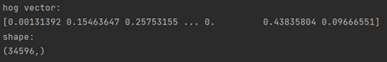
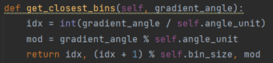

# 基于KCF 算法的目标追踪  

# 一、引言  

目标追踪是计算机视觉的一个重要任务。目标追踪是计算机视觉领域中的一个重要任务，旨在从图像或视频中准确地识别和跟踪特定的目标。这个任务的基本流程是在一段视频序列中给定目标的初始位置，然后在后续的每一帧中对目标进行持续的跟踪定位。在跟踪过程中，通常不会提供关于目标的颜色、形状、大小等先验条件，这意味着跟踪算法只能依赖于当前帧及之前帧的信息来完成跟踪。这个任务需要给定一个初始的图像区域，然后训练一个分类器来区分要跟踪的目标和它所处的环境。  

KCF 算法是一个经典的目标追踪算法，它的理论来自于信号处理中的相关滤波器概念。相关性可以衡量两个信号相似值。在目标追踪应用中，KCF 算法设计了一个滤波模板，通过与目标候选区域进行相关运算，可以找到最大输出响应的位置，从而确定当前帧的目标位置。而且，KCF 算法创造性地引入了轮转矩阵这一工具来合并大量样本，实现了一个基于“岭回归”的核相关性跟踪器，可以把这个跟踪器视为核化版的线性相关滤波器。  

这次基于KCF 算法的目标追踪实验的目的是：  

1. 深入理解HOG 特征检测算法的原理和具体步骤  
2. 了解HOG 特征描述子在KCF 核相关滤波算法中的应用  
3. 理解并自行复现KCF 核相关滤波算法  
4. 学会如何使用opencv 库实现视频导入和检测框勾选  
5. 运行KCF 核相关滤波算法实现视频目标追踪  

# 二、相关工作  

KCF 算法依赖HOG 特征描述子。HOG 特征检测算法是一种图像局部特征描述子，最早由法国研究员Dalal 等人在CVPR-2005 上提出。它利用图像中局部区域的梯度方向和梯度强度分布来表征目标外形。即使在边缘位置未知的情况下，该算法也可以通过分析边缘方向的分布来有效地描述行人目标的外形轮廓。  

KCF 全称为 Kernel Correlation Filter 即核相关滤波算法，是在 2014 年由论文《High-Speed Tracking with Kernelized Correlation Filters》提出。当时大多数目标追踪算法都采用了判别式模型，旨在区分目标对象和背景环境。为了应对自然图像的变化，该分类器通常会使用经过平移和缩放的样本块进行训练。然而，这样的样本集存在大量的冗余，即任何重叠的像素都被限制为相同。  

作者João F. Henriques 等人提出了一种基于核岭回归的跟踪器，该跟踪器不受“核化惩罚”的影响，可以降低复杂度，甚至可能低于非结构化线性回归的复杂度。此外，作者将以前的单通道灰度特征改进为多通道的HOG 特征或其他特征，这种方法在现有算法中表现出色。通过使用HOG 替换灰度特征，并利用核函数进行对偶相关滤波计算，该方法取得了很好的效果。  

接下来解释KCF 算法原理，复现KCF 算法并且实现对视频中目标的追踪任务。  

# 三、方法介绍  

KCF 核相关滤波算法的核心思想是根据当前帧的信息和之前帧的信息训练出一个相关滤波器，然后与新输入的帧进行相关性计算，得到的置信图就是预测的跟踪结果。这借鉴了信号处理中的滤波器概念，设计一个滤波模板，通过与目标候选区域进行相关运算，可以找到最大输出响应的位置，从而确定当前帧的目标位置。下面是KCF 算法的基本步骤：  

1. 载入视频，人为给定图像和初始的目标框，目标框圈定了待追踪目标的初始位置。  
2. 提取初始目标框内的信息，计算HOG 特征描述子，并在矩形框的中心采样、提取特征  
3. 使用岭回归方法训练目标检测器。岭回归可以将线性空间的映射到非线性空间，通过求解对偶问题和某些常见的约束条件，得到分类器的权重。这个滤波器可以用于预测目标在下一帧中的位置。  
4. 使用训练好的滤波器在下一帧中滑动，找到与当前帧最匹配的位置，即预测的目标位置。  
5. 根据预测的目标位置和实际检测到的目标位置，更新训练集并重新训练滤波器。  

# 3.1HOG 特征描述子  

HOG 是一种在计算机视觉和图像处理中用来对物体检测的特征描述子，将  

图像分成小的连通区域称为 cell，然后采集cell 中各像素点的梯度的或边缘的方向直方图，把这些直方图组合起来，在这些局部直方图在图像的更大的block 内进行对比度归一化，就可以构成特征描述器。  

**输入图像和预处理**  

在原论文中处理图像时，图像的尺寸缩放为 $6 4 ^ { \star 1 2 8 }$ （64 为宽，128 为高）这个大小是为了方便之后划分为cell 以及block。  

在后续的处理中，将图像划分为 $8 ^ { \star } 8$ 的cell，以及划分成 $1 6 ^ { \star 1 6 }$ 的 block，因为一个block 将会包含4 个相邻的cell。  

在计算机视觉处理中一般都以灰度图作为处理对象，所以将图像进行灰度化处理，灰度化处理可以直接在读入时处理，但是有必要了解灰度公式：  

$$
G r a y = 0 . 3 0 \times R + 0 . 5 9 \times G + 0 . 1 1 \times B
$$

Gamma 校正可以将图像整体亮度提高或降低，从而调节图像对比度，减少光照对图像的影响，使过曝或者欠曝的图像恢复正常，更接近人眼看到的图像。使用平方根的方法进行Gamma 标准化  

$$
Y \left( x , y \right) { = } I \left( x , y \right) ^ { \frac { 1 } { 2 } }
$$

  

例如我检测hog 算法使用了这张图片，这是进行了缩放和 gamma 校正的图像  

**计算梯度**  

对经过颜色空间归一化后的图像进行两个方向的滤波，求取其梯度及梯度方向，分别在水平和垂直方向进行计算，水平方向的滤波算子为[−1,0,1]，垂直方向滤波算子是水平方向滤波算子的转置：  

$$
\begin{array} { c } { { G _ { x } \left( x , y \right) { = } I \left( x + 1 , y \right) - I \left( x - 1 , y \right) } } \\ { { } } \\ { { G _ { y } \left( x , y \right) { = } I \left( x , y + 1 \right) - I \left( x , y - 1 \right) } } \end{array}
$$

接下来通过两个方向的梯度计算梯度的强度值 $g$ 和梯度方向 $\theta$ ，对每一个像素点进行计算：  

$$
\begin{array} { c } { { G ( x , y ) { = } \sqrt { G _ { x } ( x , y ) ^ { 2 } { + } G _ { y } ( x , y ) ^ { 2 } } } } \\ { { { } } } \\ { { \theta ( x , y ) { = } { \arctan } \ ( \frac { G _ { y } ( x , y ) } { G _ { x } ( x , y ) } ) } } \end{array}
$$

根据它们可以确定每个像素处梯度的大小和方向    

可视化表示为：  

**梯度方向直方图**  

在每个 $\mathsf { c e l l } ( 8 ^ { \star } 8 )$ 内统计梯度方向直方图，将所有梯度方向划分为 9 个bin（即9 维特征向量），作为直方图的横轴，角度范围所对应的梯度值累加值作为直方图纵轴。  

直 方 图 分 为 9 个 bin ， 代 表 角 度0，20，40，60，80，100，120，140，160；根据方向确定选择哪个 bin，根据幅值确定bin 的大小，如果角度值为介于上边 9 个值的值，那么需要根据距离9 个值左右值的远近在幅值上分别乘以比例来确定在这两个bin 上的大小。  

  

**Block 标准化**  

一个block 是由四个cell 组成的，将每个cell 的的9 个Bin 的直方图直接拼接为一个 $3 6 \star 1$ 的向量，之后对其归一化。归一化方法有 L1-norm、L2-norm、L1-sqrt 等。通常使用 L2-norm 进行归一化  

因此，每个 $1 6 \times 1 6$ 块由 $3 6 \times 1$ 向量表示，接着，窗口步长设置为8 个像素，按照水平和竖直两个方向滑动，把整张图遍历一遍，计算标准化的向量  

最终计算出了结果：  

# 3.2 数学基本知识  

接下来需要了解岭回归，傅里叶变换，傅里叶对角化和循环矩阵。  

**岭回归**  

在标准线性回归中，通过最小化真实值和预测值的平方误差来训练模型，最小二乘法即最小化残差平方和  

$$
J _ { \ L _ { \beta } } ( \beta ) { = } a r g m i n \sum _ { \ L _ { \beta } } ^ { p } ( y _ { i } { - } x _ { i } \beta _ { i } { - } \beta _ { 0 } ) ^ { 2 }
$$

求得：  

$$
{ \boldsymbol { \beta } } \mathbf { = } \{ \boldsymbol { X } ^ { T } \boldsymbol { X } \} \boldsymbol { X } ^ { T } \boldsymbol { y }
$$

然而现实任务中 $X ^ { T } X$ 有可能不是满秩矩阵，所以可以在对角线上加上一个很小的参数为 $\lambda$ 的对角矩阵，那么结果为：  

$$
\beta _ { \mathrm { r i d g e } } = ( X ^ { T } X + \lambda I _ { n } ) ^ { - 1 } X ^ { T } Y
$$

损失函数也加上了λ的对角矩阵的部分：  

$$
\begin{array} { c c } { { J _ { \beta } \big ( \beta \big ) } } & { { \displaystyle \dot { \zeta } \sum _ { i = 1 } ^ { p } \big ( y _ { i } - X _ { i } \beta \big ) ^ { 2 } + \lambda \sum _ { j = 0 } ^ { n } \beta _ { j } ^ { 2 } } } \\ { { \dot { \lambda } } } & { { \dot { \lambda } } } \end{array}
$$

岭回归是一种改良的最小二乘估计法，通过放弃最小二乘法的无偏性，以损失部分信息、降低精度为代价获得回归系数，它是更为符合实际、更可靠的  

回归方法，对存在离群点的数据的拟合要强于最小二乘法。  

# 傅里叶变换  

傅里叶变换是一种线性积分变换，用于函数在时域和频域之间的变换，将函数分解为不同特征的正弦函数的和。在本实验中，用于获得图像的频域信息  

在二维图像中，假设每一行由N 个点组成，对每一行的一维N 点序列进行离散傅里叶变换得到 $\mathsf { F } ( \mathsf { x } , \mathsf { u } )$ ,再对得到 $\mathsf { F } ( \mathsf { x } , \mathsf { u } )$ 按列向对每一列做M 点的离散傅里叶变换，就可以得到二维图像 $\mathsf { f } ( \mathsf { x } , \mathsf { y } )$ 的离散傅里叶变换 $\mathsf { F } ( \mathsf { u } , \mathsf { v } )$  

$$
f { \bigl ( } x , y { \bigr ) } = \sum _ { u = 0 } ^ { M - 1 } { \bigl [ } \sum _ { v = 0 } ^ { N - 1 } F { \bigl ( } u , v { \bigr ) } \exp { \bigl ( } j 2 \pi v y / N { \bigr ) } { \bigr ] } \exp { \bigl ( } j 2 \pi u x / M { \bigr ) }
$$

循环矩阵  

根据参考文献[3]任意循环矩阵可以被傅里叶变换矩阵对角化。  

由原向量x可生成循环矩阵 $C \left( { \boldsymbol { x } } \right)$ ：  

$$
X = C ( \mathbf { x } ) = { \left[ \begin{array} { l l l l l } { x _ { 1 } } & { x _ { 2 } } & { x _ { 3 } } & { \cdots } & { x _ { n } } \\ { x _ { n } } & { x _ { 1 } } & { x _ { 2 } } & { \cdots } & { x _ { n - 1 } } \\ { x _ { n - 1 } } & { x _ { n } } & { x _ { 1 } } & { \cdots } & { x _ { n - 2 } } \\ { \vdots } & { \vdots } & { \vdots } & { \ddots } & { \vdots } \\ { x _ { 2 } } & { x _ { 3 } } & { x _ { 4 } } & { \cdots } & { x _ { 1 } } \end{array} \right] }
$$

对角化为：  

$$
\boldsymbol { X } = \boldsymbol { F } d i a g \stackrel { \boldsymbol { i } } { \left( \boldsymbol { x } \right) } \boldsymbol { F } ^ { \boldsymbol { H } }
$$

这一特性将在后续计算中用到。  

# 3.3 核相关性滤波  

KCF 采用岭回归的方法，训练的目标是找到一个函数 $\boldsymbol { f } \left( \boldsymbol { z } \right) = \boldsymbol { w } ^ { T } \boldsymbol { z }$ ，损失函数为：  

$$
m i n \sum _ { w } \sqsupset \sqsupset ( f ( x _ { i } ) - y _ { i } ) ^ { 2 } + \lambda \| w \| ^ { 2 }
$$

$\lambda$ 为控制过拟合的正则化参数，也是岭回归中加入的对角化矩阵的参数。  

令损失函数的值L 为0，求解可得：  

$$
\boldsymbol { w } = \left( \boldsymbol { X } ^ { H } \boldsymbol { X } + \lambda \boldsymbol { I } \right) ^ { - 1 } \boldsymbol { X } ^ { H } \boldsymbol { y }
$$

根据循环矩阵乘法性质：根据循环矩阵能够被离散傅里叶矩阵对角化，使得矩阵求逆转换为特征值求逆的性质；能够将 $\boldsymbol { \mathsf { w } }$ 的求解转换到频域进行运算，应用离散傅里叶变换(DFT)提高运算速度，然后再将解逆变换回空域从而得到响应最大的解。  

由上面的推导可知：  

$$
\boldsymbol { X } = \boldsymbol { F } d i a g \stackrel { \boldsymbol { i } } { \left( \boldsymbol { x } \right) } \boldsymbol { F } ^ { \boldsymbol { H } }
$$

令 $\textit { \ i }$ 为向量 经过傅里叶变换之后的向量，而F 则为离散傅里叶矩阵x我们将这个 $X$ 带入到上面我们求解得到的 $w$ 中，推导的结果如下：  

$$
\begin{array} { r l } & { w = ( X X + \lambda I ) ^ { - 1 } X ^ { H } y } \\ & { \quad = \Big ( F \operatorname { d i a g } \Big ( \hat { x } ^ { * } \bigodot \hat { x } \Big ) F ^ { H } + F \operatorname { d i a g } ( \lambda ) F ^ { H } \Big ) ^ { - 1 } X ^ { H } y } \\ & { \quad = \Big ( F \operatorname { d i a g } \Big ( \hat { x } ^ { * } \bigodot \hat { x } + \lambda \Big ) F ^ { H } \Big ) ^ { - 1 } X ^ { H } y } \\ & { \quad = \bigg ( F \operatorname { d i a g } \bigg ( \frac { \hat { x } ^ { * } } { \hat { x } ^ { * } \bigodot { \hat { x } } + \lambda } \bigg ) F ^ { H } \bigg ) y } \end{array}
$$

利用傅里叶变换中的反对角化性质可以得到：  

$$
w { = } C \big ( F ^ { - 1 } \big ( \frac { x ^ { \dot { \iota } } } { \iota _ { \dot { \iota } } ^ { \dot { \iota } } \bigcirc x + \lambda } \big ) \big ) y
$$

接下来使用核技巧，因为循环矩阵有性质：  

$$
F { \bigl ( } C { \bigl ( } x { \bigr ) } y { \bigr ) } { = } F * { \bigl ( } x { \bigr ) } \odot F { \bigl ( } y { \bigr ) }
$$

因此滤波方程表示为：  

$$
F ( w ) = F { \big ( } C ( x ) y { \big ) } = { \big ( } { \frac { \stackrel { i } { x } } { \stackrel { i } { x } } { \stackrel { i } { \bigodot } } x + \lambda } { \stackrel { i } { \bigodot } } F { \big ( } y { \big ) } = { \frac { \stackrel { i } { x } { \bigodot } \stackrel { i } { y } } { \stackrel { i } { x } { \bigodot } x + \lambda } }
$$

引入核技巧之后，问题转变为：  

$$
f \left( { \boldsymbol { z } } \right) = { \boldsymbol { w } } ^ { T } { \boldsymbol { z } } = \sum _ { i = 1 } ^ { n } \Omega \alpha _ { i } \psi { \boldsymbol { \left( { \boldsymbol { x } } _ { i } \right) } } \psi { \boldsymbol { \left( { \boldsymbol { z } } _ { i } \right) } } = \sum _ { i = 1 } ^ { n } \Omega \alpha _ { i } \kappa { \boldsymbol { \left( { \boldsymbol { z } } , { \boldsymbol { x } } _ { i } \right) } }
$$

因此得到问题的解为：  

$$
\stackrel { \dot { \iota } } { \alpha } = \frac { \stackrel { \dot { \iota } } { y } } { \stackrel { \dot { k } ^ { x x } } { \alpha } + \lambda }
$$

则滤波方程为：  

$$
\stackrel { \circ } { f } ( z ) = \stackrel { \circ } { k } ^ { x z } \odot \stackrel { \circ } { \alpha }
$$

当输入图像z时，可以构造 $\mathsf { x }$ 和z 的核相关矩阵，进行回归检测。  

# 四、实验  

# 4.1 实验环境  

处理器为 12th Gen Intel(R) Core(TM) i7-12700H   2.30 GHz  

机带 RAM 为 16.0 GB (15.7 GB 可用)  

实验在 Windows11 系统上，在 pycharm 平台，使用 python3.9 实现，调用的库为 opencv-python4.7.0,numpy 库  

代码分为两个部分，一个是KCF . py用来实现KCF 算法，另一个是run. py用于导入待检测视频并调用KCF 进行目标追踪。  

# 4.2 实验困难  

在实验一开始的时候，对HOG 算法的理解让我感到困惑，因为我对于 cell和block 的概念极力想要辨认清楚，但是其实 cell 用于直方图，而block 用于后续归一化的步骤中，定义如下，但是分步使用。  

梯度计算在一开始我没有理解到，是对每一个点进行计算，但是实际上最后产生的矩阵与原矩阵大小相同，计算过程如下：  

分配方向时一开始我以为是只能分配到一个方向，但是实际上是按照距离进行加权分配  

  

一开始我不理解gaussian_peak 的作用，所以一开始并没有这个部分，但是后来我学习到了高斯峰值的作用是作为目标模板，用于与图像中的目标进行匹配和跟踪，高斯函数具有平滑的曲线形状，可以适应不同形状的目标，并且可以通过调整高斯函数的参数来控制目标模板的大小和形状。  

作用是在矩形框的中心采样后，对采样之后的hog 特征描述子进行高斯平滑，使得最后的模板更加平滑。  

我在计算出了hog 特征描述子之后一开始直接进行比对计算，但是实际上需要对特征描述子进行行和列的高斯滤波，用于减少噪声。  

  

傅里叶变换和模板计算很难以理解，我经过了很长的时间才懂得了原理：  

这一步我直接使用了numpy 的库进行计算，但是我觉得我还需要手动实现一下离散傅里叶变换，我对它的原理还不是很清晰。  

另外，视频的导入和目标框的获取我觉得有些困难，不过后来搜索之后使用opencv 的函数可以直接实现： 

 

# 4.3 实验结果  

**行车车辆检测**  

  

首先选中目标检测物  

然后随着目标的移动，目标框一直可以框住车辆，而且目标框能够按照原本的相对位置，框住整个车辆，大小也会随车辆而变化。  

在边角状态下，目标框虽然还可以框住车体，但是大小和形状已经发生了改变  

  

**夜晚船检测**  

  

可以检测到船的航行，没有和周围的物体混淆  

因此，本次实验实现的 KCF 算法基本可以实现目标追踪，准确率也较高，但是存在的问题是在边缘，尤其是物体的形状发生了明显改变的情况下，检测不能有效进行。  

分析原因，这是因为目标框的特征来自于 HOG 特征描述子，这个描述方式会记录下目标框内的所有信息，虽然cell 和block 的设计可以提升鲁棒性，但是每个像素点的信息最终都参与到了计算中，这导致离群点会扰动最终的结果。  

下一步的改进是提升算法的鲁棒性。KCF 算法中的HOG 特征描述已经借鉴了SIFT 算法的直方图等等思想，也可以再借鉴关键点思想，也即只挑选对识别有突出贡献的关键点参与到特征描述中，这样可以减少离群点的影响以及物体转身、变形、部分遮掩造成的扰动，提升模型的鲁棒性。  

# 五、总结  

这次project 实验让我学习到了很多的东西，我感觉这次试验非常有意义  

这次的实验有着很强的数学属性，让我感受到数学在计算机视觉中的重要作用。虽然上次的SIFT 算法也有很多的原理推导过程，不过我认为那些主要属于工程学方面的设计，理论支持并不完善。而这次涉及到了岭回归，傅里叶变换，傅里叶对角化和循环矩阵，核技巧这么多的数学知识。这让我回忆起了之前在机器学习的课程中学习的 SVM，虽然SVM 已经是20 多年前的算法了，但是其中的核技巧还是给十几年后的KCF 算法提供了思路借鉴。  

这次的实验让我认识到了学科交叉的重要性。信号处理方面的内容在计算机视觉方面有很大的应用，不只是在这个实验中。首先傅里叶变换就有很多应用，图像转换到频域可以进行高通滤波和低通滤波。在这次的实验中，我更深刻认识到了傅里叶变换的作用，傅里叶变换可以将空域的信息转换到频率，这样可以加快计算的速度，在频域计算之后，结果再转换回空域。另外，这次的KCF 算法借鉴了信号处理里面的相关滤波器的概念，用一个训练好的分类器来对图像进行滤波，这样可以比对出最合适的一块区域作为目标追踪的预测结果。  

这次的实验让我理解了目标追踪这个任务。KCF 算法是目标追踪方面的经典算法。这让我理解到，目标追踪首先可以使用 opencv 库来导入视频，并且使用ROI 来圈定目标框。目标追踪需要学习目标框内的内容，也即正样本，来学习目标的特点，最后在每一帧中计算出最符合原目标框内的目标，然后返回预测框。以往的模型基于正样本进行学习，而 KCF 算法则正样本和负样本都进行学习。目标追踪需要解决的是鲁棒性问题，在 KCF 算法中，通过 block 和cell 来提升鲁棒性，不过我下一步还将会引入关键点进行改进的尝试。  

# 参考文献  

[1] N. Dalal and B. Triggs, "Histograms of oriented gradients for human detection," 2005  IEEE  Computer  Society  Conference  on  Computer  Vision  and  Pattern Recognition  (CVPR'05),  San  Diego,  CA,  USA,  2005,  pp.  886-893  vol.  1,  doi: 10.1109/CVPR.2005.177.   
[2] J. F. Henriques, R. Caseiro, P. Martins and J. Batista, "High-Speed Tracking with Kernelized Correlation Filters," in IEEE Transactions on Pattern Analysis and Machine  Intelligence,  vol.  37,  no.  3,  pp.  583-596,  1  March  2015,  doi: 10.1109/TPAMI.2014.2345390.   
[3] Gray, Robert M. Toeplitz and circulant matrices: A review. now publishers inc, 2006. $\hookleftarrow$  